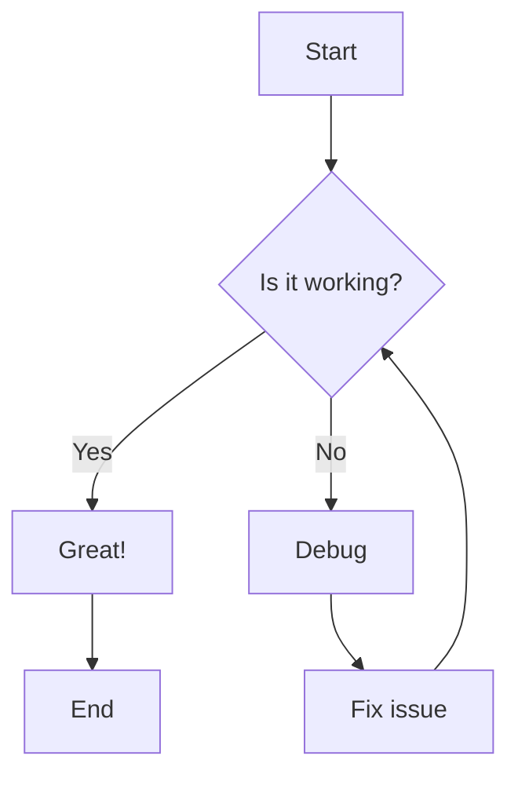
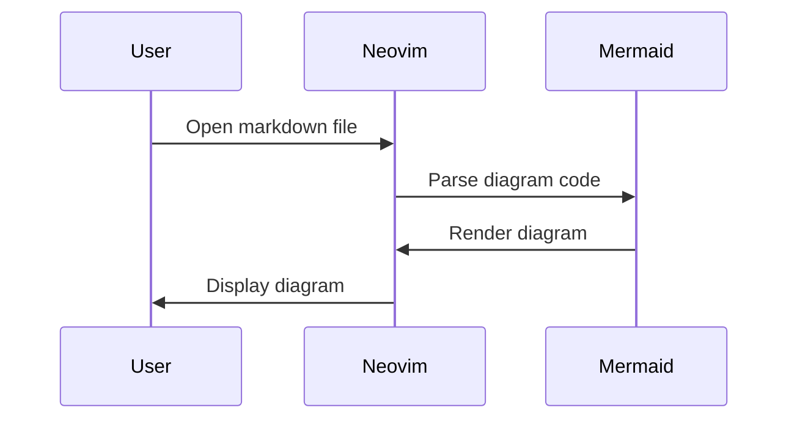
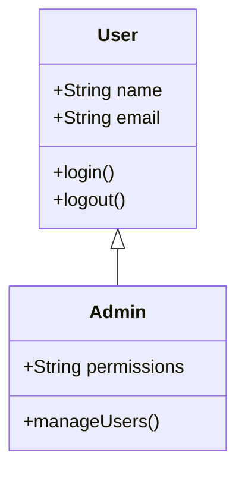
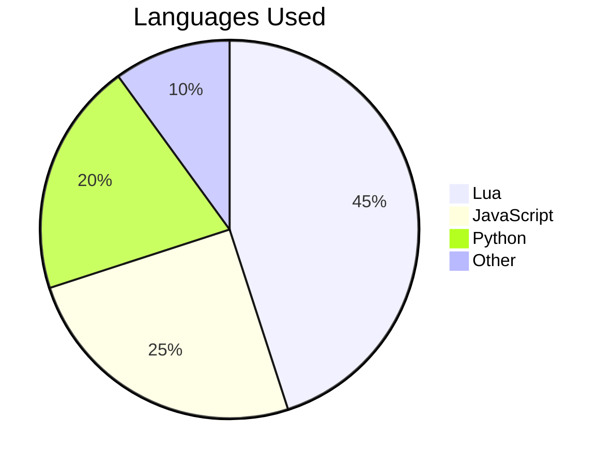

# Mermaid Test File

This file contains various Mermaid diagram examples to test the rendering functionality.

## Flowchart Example



## Sequence Diagram



## Class Diagram



## Git Graph

```mermaid
gitgraph
    commit id: "Initial commit"
    branch feature
    checkout feature
    commit id: "Add feature"
    commit id: "Fix bug"
    checkout main
    merge feature
    commit id: "Release"
```

## Pie Chart



## Instructions

### Browser Preview (Recommended)
1. Open this file in Neovim
2. Press `<leader>mp` to toggle browser preview with Mermaid rendering
3. Diagrams will be rendered in the browser automatically

### Export Diagrams
1. Run `:MermaidInstall` to install Mermaid CLI (if not already installed)
2. Use `:MermaidExport` to export all diagrams to PNG files

### Features
- **Syntax highlighting** for mermaid code blocks
- **Browser preview** with live Mermaid rendering
- **Export to PNG** using Mermaid CLI
- **Simplified setup** without complex terminal dependencies

No complex terminal image rendering needed - just use the browser preview!