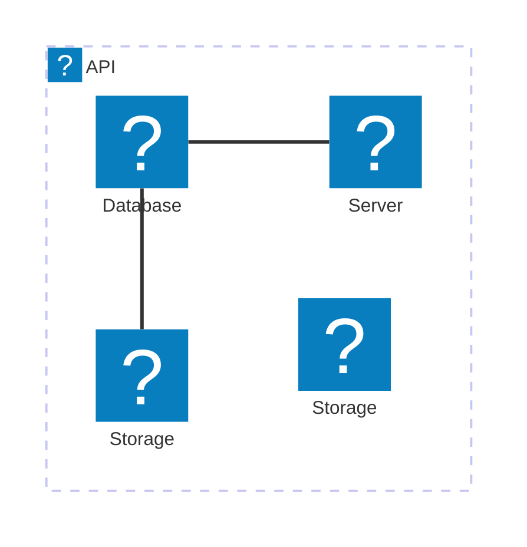

```mermaid
architecture-beta

    group api(logos:aws-iam)[API]

    service db(logos:aws-aurora)[Database] in api

    service storage1(logos:aws-glacier)[Storage] in api

    service storage2(logos:aws-s3)[Storage] in api

    service server(logos:aws-ec2)[Server] in api

    db:R -- L:server
    storage2:T -- B:db
```
